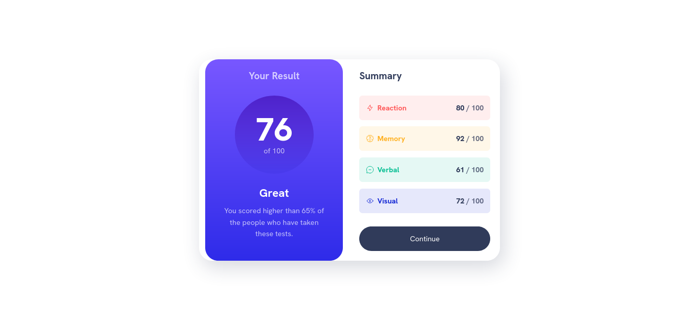

# Frontend Mentor - Results summary component solution

This is a solution to the [Results summary component challenge on Frontend Mentor](https://www.frontendmentor.io/challenges/results-summary-component-CE_K6s0maV). Frontend Mentor challenges help you improve your coding skills by building realistic projects. 

## Table of contents

- [Overview](#overview)
  - [Screenshot](#screenshot)
  - [Links](#links)
- [My process](#my-process)
  - [Built with](#built-with)
  - [What I learned](#what-i-learned)
  - [Useful resources](#useful-resources)
- [Author](#author)

## Overview
The Results Summary component challenge tasks participants with building a user interface for generating and displaying QR codes within a web application. Key aspects of the challenge include:

   - Designing a visually appealing and responsive UI using HTML and CSS.
   - See hover states for interactive elements.
   - Measuring your Designing skills.

### Screenshot
Desktop Design

### Links

- Solution URL: [Solution](https://www.frontendmentor.io/solutions/results-summary-component-using-tailwindcss-ck5DtdRoNM)
- Live Site URL: [Demo](https://results-summary-component-tailwindcss.vercel.app/)

## My process

### Built with

- Semantic HTML5 markup
- Tailwindcss CSS Framework
- Flexbox
- Gridbox
- Responsive Design
- Mobile-first workflow
- [Tailwindcss](https://tailwindcss.com/) - CSS Framework

### What I learned

In the Results Summary code component challenge on Frontend Mentor, you likely learned several key skills and concepts, including:

1. HTML and CSS: Building a visually appealing and responsive user interface (UI) for the Results Summary Component using HTML for structure and CSS for styling. This involves understanding layout techniques, such as Flexbox or Grid, to create a well-organized and visually appealing design.

   
2. Responsive Design: Creating a UI that adapts seamlessly to various screen sizes and devices, using CSS techniques like media queries to adjust layout and styling based on viewport dimensions.

3. Documentation and Best Practices: Documenting your code and adhering to best practices for code organization, naming conventions, and commenting to make your codebase more maintainable and understandable for yourself and other developers.

Overall, participating in the Results Summary code component challenge on Frontend Mentor likely provided you with valuable hands-on experience in frontend development, covering HTML, CSS, JavaScript, and various related concepts and technologies.

### Useful resources

- [Tailwindcss Documentation](https://tailwindcss.com/docs/installation) - This helped me for many reasons. I really liked this documentation and will use it going forward.

## Author

- Frontend Mentor - [@sipanahmad](https://www.frontendmentor.io/profile/sipanahmad)
- Linkedin - [@ahmadsipan](https://www.linkedin.com/in/ahmadsipan/)
- GitHub - [@sipanahmad](https://github.com/sipanahmad)

